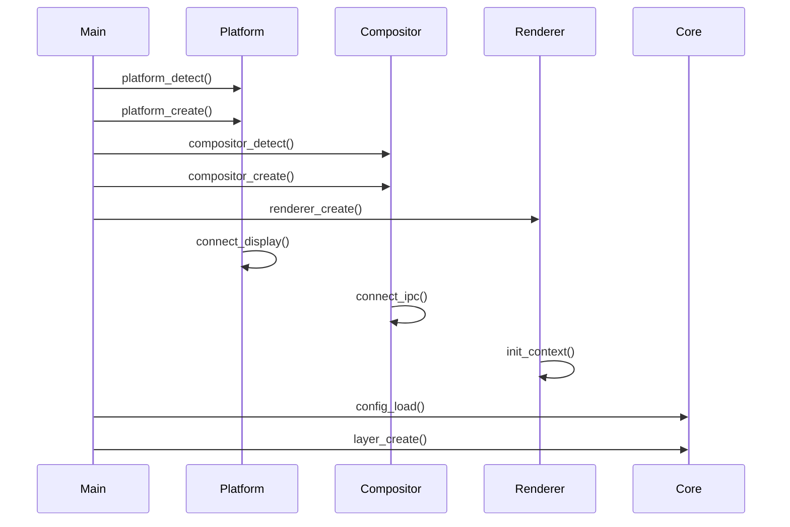
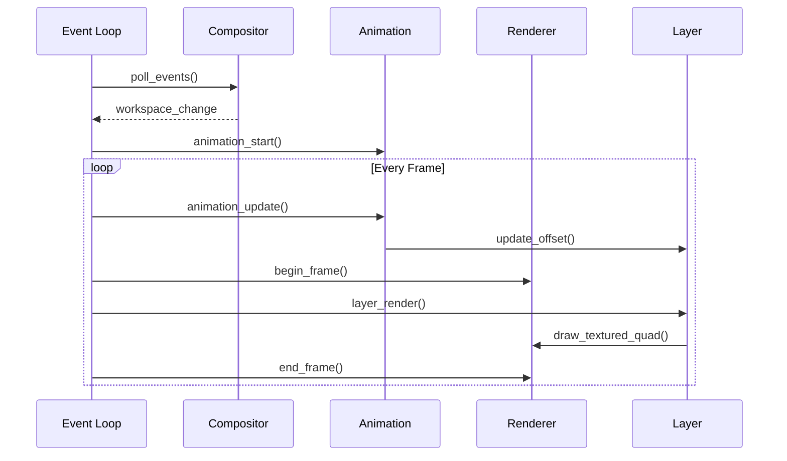

# Architecture Documentation

## Overview

hyprlax uses a modular architecture designed for extensibility and maintainability. The system is built with clear separation of concerns, allowing easy addition of new compositors, platforms, and rendering backends.

## Design Philosophy

### Core Principles

1. **Platform Independence** - Abstract platform-specific details
2. **Compositor Agnostic** - Support any compositor through adapters
3. **Renderer Flexibility** - Allow different rendering backends
4. **Module Isolation** - Each module has a single responsibility
5. **Runtime Configuration** - Dynamic feature detection and configuration

## Module Architecture

```
┌────────────────────────────────────────────────────────────────┐
│                         Application                            │
│                  (main.c, hyprlax_main.c)                      │
└───────────────┬─────────────────────────────────┬──────────────┘
                │                                 │
        ┌───────▼───────┐                 ┌───────▼───────┐
        │   IPC Server  │                 │   Core Engine │
        │     (ipc.c)   │                 │               │
        └───────────────┘                 └───────┬───────┘
                                                  │
        ┌───────────────────────┬───────────────────────┐
        │                       │                       │
┌───────▼───────┐       ┌───────▼───────┐        ┌──────▼───────┐
│   Platform    │       │  Compositor   │        │   Renderer   │
│    Layer      │       │    Adapter    │        │    Layer     │
├───────────────┤       ├───────────────┤        ├──────────────┤
│   Wayland     │       │   Hyprland    │        │   GLES2      │
└───────────────┘       │     Sway      │        │   Shader     │
                        │     River     │        └──────────────┘
                        │    Wayfire    │
                        │     Niri      │
                        └───────────────┘

```

## Module Descriptions

### Core Modules (`src/core/`)

#### animation.c
- **Purpose**: Manages animation state and transitions
- **Key Functions**:
  - `animation_update()` - Update animation frame
  - `animation_start()` - Begin new animation
  - `animation_is_active()` - Check animation state
- **Dependencies**: easing.c

#### config.c
- **Purpose**: Configuration parsing and management
- **Key Functions**:
  - `config_load()` - Load configuration file
  - `config_parse_layer()` - Parse layer definition
  - `config_get_*()` - Configuration getters
- **Dependencies**: None

#### easing.c
- **Purpose**: Easing function implementations
- **Key Functions**:
  - `easing_apply()` - Apply easing to value
  - `easing_from_string()` - Parse easing type
- **Supported Easings**: linear, sine, expo, cubic, elastic, bounce

#### layer.c
- **Purpose**: Layer management and compositing
- **Key Functions**:
  - `layer_create()` - Create new layer
  - `layer_update()` - Update layer properties
  - `layer_render()` - Render layer
- **Dependencies**: renderer

### Platform Modules (`src/platform/`)

#### platform.c
- **Purpose**: Platform abstraction interface
- **Key Functions**:
  - `platform_detect()` - Auto-detect platform
  - `platform_create()` - Create platform instance
  - `platform_connect()` - Connect to display server
- **Implementations**: wayland.c

#### wayland.c
- **Purpose**: Wayland platform implementation
- **Protocols Used**:
  - wl_compositor
  - wl_shm
  - wl_seat
  - zwlr_layer_shell_v1
  - xdg_shell
- **Key Features**:
  - Layer shell surface creation
  - EGL window management
  - Event handling

### Compositor Adapters (`src/compositor/`)

#### compositor.c
- **Purpose**: Compositor adapter interface
- **Key Functions**:
  - `compositor_detect()` - Auto-detect compositor
  - `compositor_create()` - Create compositor adapter
  - `compositor_connect_ipc()` - Connect to compositor IPC
- **Registry**: Maps compositor types to implementations

#### Compositor Implementations

| File | Compositor | IPC Method | Special Features |
|------|------------|------------|------------------|
| hyprland.c | Hyprland | Unix socket | Event streaming, blur control |
| sway.c | Sway | i3 IPC protocol | JSON messages, workspace events |
| river.c | River | Control socket | Tag-based workspaces |
| wayfire.c | Wayfire | DBus/Socket | 2D workspace grid |
| niri.c | Niri | Custom IPC | Scrollable workspaces |
| generic_wayland.c | Generic | None | Basic layer shell |

### Renderer Modules (`src/renderer/`)

#### renderer.c
- **Purpose**: Renderer abstraction interface
- **Key Functions**:
  - `renderer_create()` - Create renderer instance
  - `renderer_init()` - Initialize rendering context
  - `renderer_draw_frame()` - Render single frame
- **Implementations**: gles2.c (future: vulkan.c)

#### gles2.c
- **Purpose**: OpenGL ES 2.0 renderer implementation
- **Key Features**:
  - EGL context management
  - Texture loading and management
  - Shader program compilation
  - Frame buffer operations

#### shader.c
- **Purpose**: Shader compilation and management
- **Key Functions**:
  - `shader_compile()` - Compile shader from source
  - `shader_compile_blur()` - Generate blur shader
  - `shader_create_program()` - Link shader program
- **Shader Types**: vertex, fragment, blur

## Data Flow

### Initialization Sequence



### Frame Rendering



## Interface Definitions

### Platform Interface

```c
typedef struct platform_ops {
    int (*init)(void);
    void (*destroy)(void);
    int (*connect)(void);
    void (*disconnect)(void);
    int (*create_window)(window_config_t *config);
    void (*destroy_window)(void);
    int (*get_display_size)(int *width, int *height);
    int (*poll_events)(platform_event_t *event);
    void (*swap_buffers)(void);
} platform_ops_t;
```

### Compositor Interface

```c
typedef struct compositor_ops {
    int (*init)(void *platform_data);
    void (*destroy)(void);
    bool (*detect)(void);
    const char* (*get_name)(void);
    int (*create_layer_surface)(void *surface, layer_surface_config_t *config);
    int (*get_current_workspace)(void);
    int (*get_workspace_count)(void);
    int (*connect_ipc)(const char *socket_path);
    int (*poll_events)(compositor_event_t *event);
    bool (*supports_blur)(void);
    int (*set_blur)(float amount);
} compositor_ops_t;
```

### Renderer Interface

```c
typedef struct renderer_ops {
    int (*init)(void *native_display, void *native_window);
    void (*destroy)(void);
    int (*begin_frame)(void);
    int (*end_frame)(void);
    int (*load_texture)(const char *path, texture_t *texture);
    void (*draw_textured_quad)(texture_t *texture, float x, float y, 
                               float width, float height, float opacity);
    int (*set_blur)(float amount);
    void (*clear)(float r, float g, float b, float a);
} renderer_ops_t;
```

## Extension Points

### Adding a New Compositor

1. Create `src/compositor/newcomp.c`
2. Implement `compositor_ops_t` interface
3. Add to compositor registry in `compositor.c`
4. Add type to `compositor_type_t` enum
5. Update detection logic

### Adding a New Platform

1. Create `src/platform/newplat.c`
2. Implement `platform_ops_t` interface
3. Add to platform registry in `platform.c`
4. Add type to `platform_type_t` enum
5. Update detection logic

### Adding a New Renderer

1. Create `src/renderer/newrend.c`
2. Implement `renderer_ops_t` interface
3. Add to renderer registry in `renderer.c`
4. Add type to `renderer_type_t` enum
5. Update initialization logic

## Configuration

### Runtime Detection

The system uses a priority-based detection system:

1. Environment variables (`HYPRLAX_COMPOSITOR`, `HYPRLAX_PLATFORM`)
2. Auto-detection based on environment
3. Fallback to generic implementation

### Feature Negotiation

Each module reports its capabilities:
- Compositors report blur, transparency, animation support
- Renderers report shader, texture format support
- Platforms report protocol availability

## Performance Considerations

### Memory Management
- Texture atlas for multiple layers
- Lazy loading of resources
- Proper cleanup on module destruction

### Rendering Optimization
- Frame skipping when idle
- Damage tracking for partial updates
- VSync control

### IPC Efficiency
- Non-blocking I/O
- Event batching
- Minimal polling frequency

## Security Considerations

### Input Validation
- Config file parsing sanitization
- IPC message validation
- Path traversal prevention

### Resource Limits
- Maximum layer count
- Texture size limits
- Memory usage caps

### Privilege Separation
- No elevated privileges required
- User-space only operation
- Sandboxing compatible

## Future Enhancements

### Planned Modules
- Vulkan renderer
- Video decoder for animated wallpapers
- Network control interface

### Architectural Improvements
- Plugin system for external modules
- Dynamic module loading
- Configuration hot-reload

## Testing Strategy

### Unit Tests
- Each module has isolated tests
- Mock interfaces for dependencies
- Coverage targets: >80%

### Integration Tests
- Platform + Compositor combinations
- Renderer + Platform combinations
- End-to-end scenarios

### Performance Tests
- Frame rate benchmarks
- Memory usage profiling
- Latency measurements
